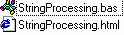



## String Processing Library \(Parsing, Translation, Validation\)

### Description

Library of routines for typical string processing, including parsing, translation, and validation. Routines include:

- StrReplace(Text, SearchFor, ReplaceWith, [Compare]) As String

 - StrSplit(Text, SplitOn, [Compare]) As Variant

 - FromHex(HexNumber) As Long

 - LeftPad(Value, Size, [PadCharacter]) As String

 - RightPad(Value, Size, [PadCharacter]) As String

 - AreLetters(Text) As Boolean

 - AreDigits(Text) As Boolean

 - AreLettersOrDigits(Text) As Boolean

 - AreInSet(Text, CharacterSet, [CaseSensitive]) As Boolean

 - ParseN(Text, StartAt, PatternArray, ValueArray, [PosPastEnd], [StopAt], [Compare]) As Boolean

Clean code with lots of comments in reusable module. Also includes an extensive reference in HTML. Tested with VB6, but should be compatible with all modern versions and VBScript (with minor modifications).

Please vote for this code if you like it.
 
### More Info
 

             |
---                |---
**Submitted On**   |2000-06-01 14:59:56
**By**             |[James Vincent Carnicelli](https://github.com/Planet-Source-Code/PSCIndex/blob/master/ByAuthor/james-vincent-carnicelli.md)
**Level**          |Intermediate
**User Rating**    |4.8 (43 globes from 9 users)
**Compatibility**  |VB 3\.0, VB 4\.0 \(16\-bit\), VB 4\.0 \(32\-bit\), VB 5\.0, VB 6\.0, VB Script, ASP \(Active Server Pages\) 
**Category**       |[String Manipulation](https://github.com/Planet-Source-Code/PSCIndex/blob/master/ByCategory/string-manipulation__1-5.md)
**World**          |[Visual Basic](https://github.com/Planet-Source-Code/PSCIndex/blob/master/ByWorld/visual-basic.md)
**Archive File**   |[CODE\_UPLOAD69946222000\.zip](https://github.com/Planet-Source-Code/james-vincent-carnicelli-string-processing-library-parsing-translation-validation__1-8524/archive/master.zip)

